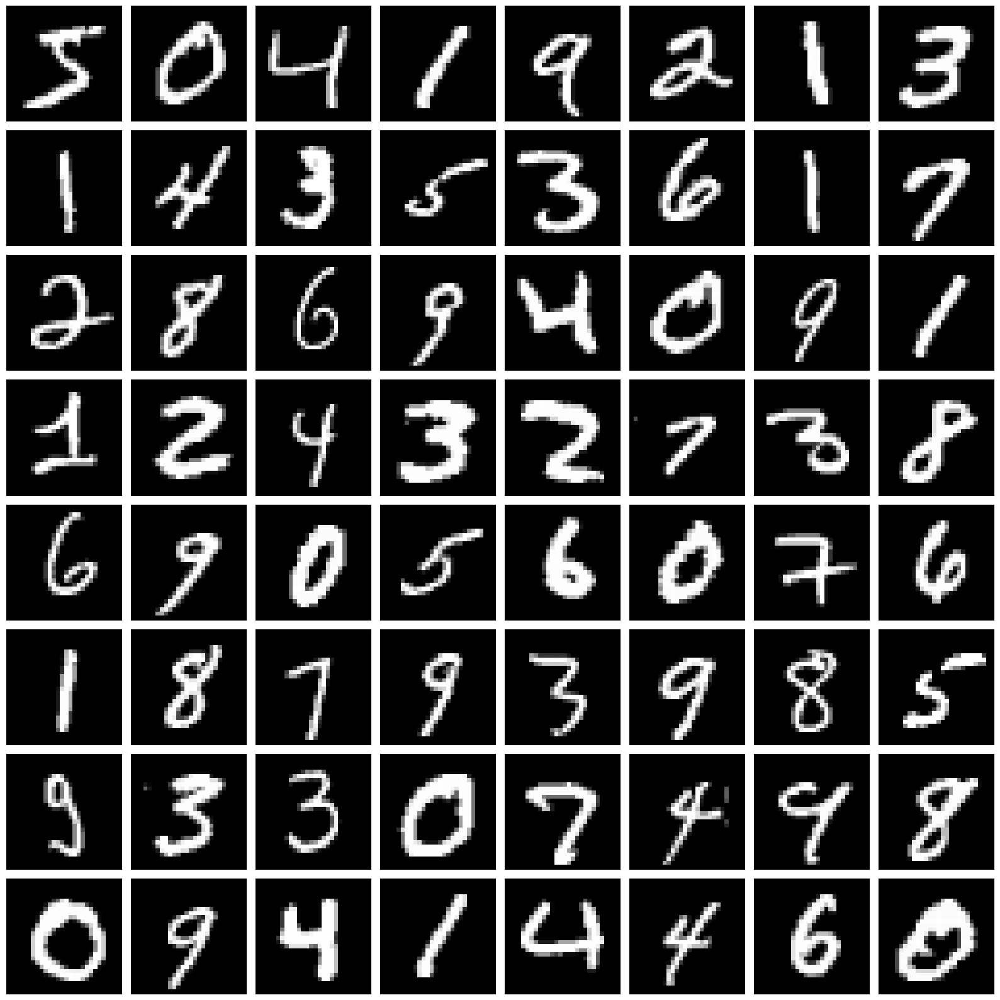
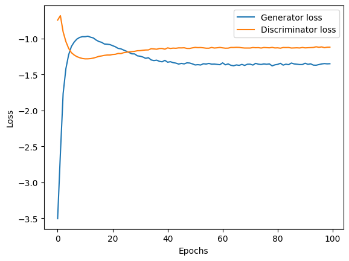
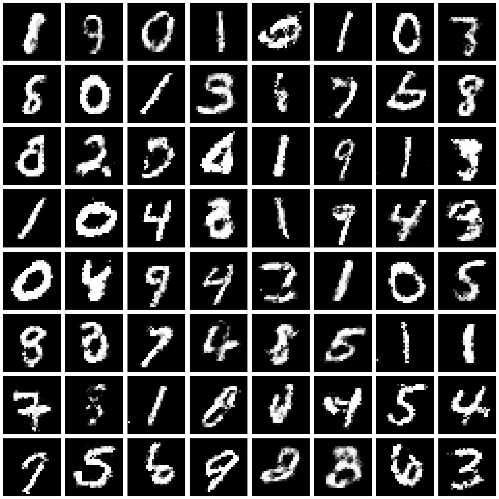
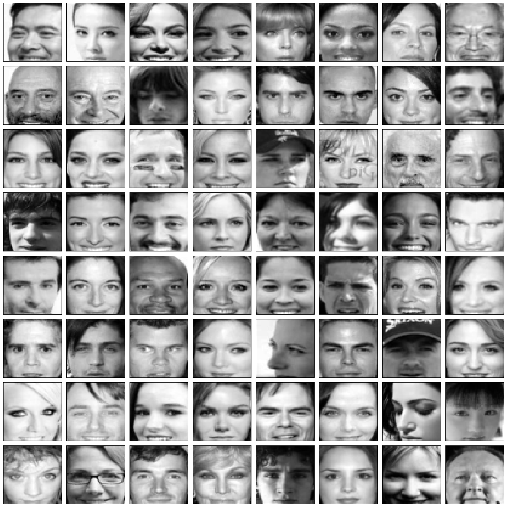
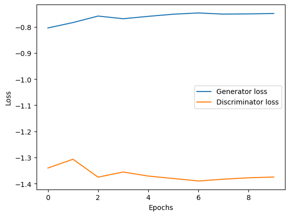
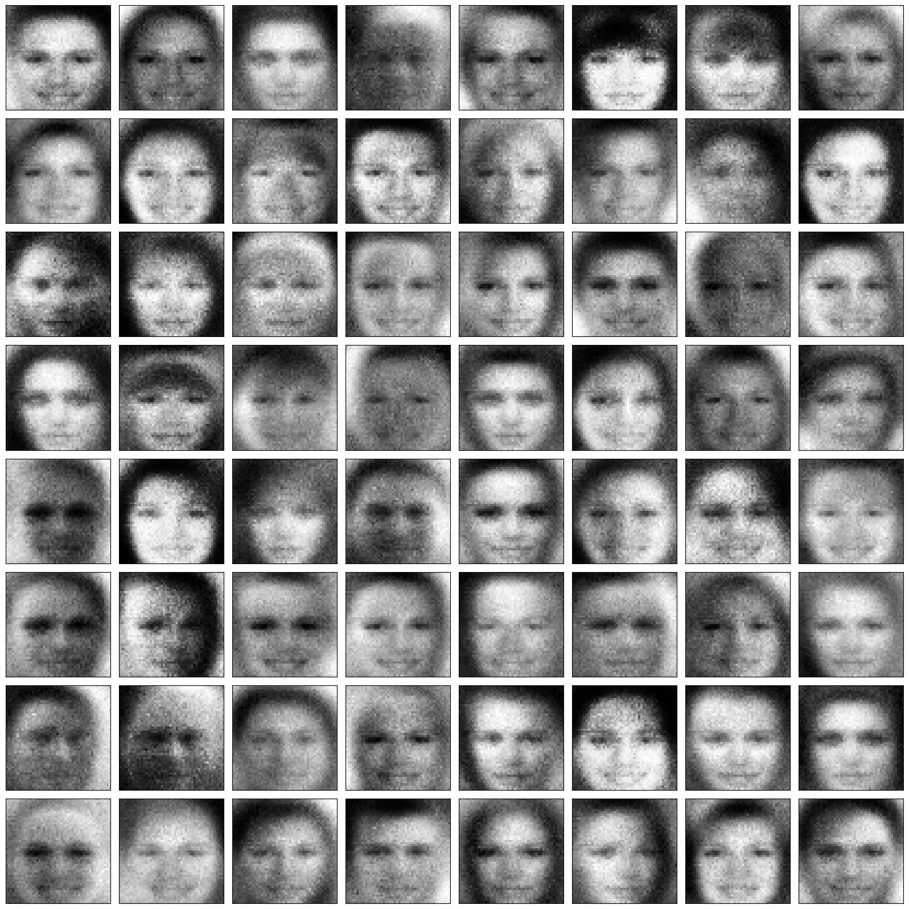

# Generative Adversarial Networks (Goodfellow et al., 2014)
This code tries to reproduce the 2014 Goodfellow et al. paper [Generative Adversarial Networks](https://arxiv.org/abs/1406.2661).

Original code and hyperparameters from the paper can be found [here](https://github.com/goodfeli/adversarial).


## MNIST (fully connected model)

#### Model Architecture:

Generator:
* Input layer: 100 units (Uniform[-1, 1] noise)
* Dense layer: 1200 units, ReLU
* Dense layer: 1200 units, ReLU
* Output layer: 784 units, Sigmoid
* Learnable parameters: 2503984

Discriminator:
* Input layer: 784 units (flattend 28x28 gray-scale image)
* Maxout layer: 240 units, 5 pieces
* Maxout layer: 240 units, 5 pieces
* Output layer: 1 unit, Sigmoid 
* Learnable parameters: 1231441

#### Hyperparameters/Settings:
* Epochs: 100  
* Batch size: 100
* Generator optimizer: Adam
* Discriminator optimizer: Adam
* Generator learning rate: 0.002  
* Discriminator learning rate: 0.002  
* Generator betas: (0.5, 0.99)  
* Discriminator betas: (0.5, 0.99)  

#### Training Data:


#### GAN Training Losses:



#### Fake Data:


## CelebFaces (fully connected model)

#### About the Dataset
[CelebFaces Attributes (CelebA) Dataset:](https://www.kaggle.com/datasets/jessicali9530/celeba-dataset)
Over 200k images of celebrities with 40 binary attribute annotations.

#### Model Architecture:

Generator:
* Input layer:    100 units (Uniform[-1, 1] noise)
* Dense layer:    8000 units, ReLU
* Output layer:   2304 units, Sigmoid
* Learnable parameters: 19242304

Discriminator:
* Input layer: 2304 units (flattend 48x48 grayscale image)
* Maxout layer: 1200 units, 5 pieces
* Maxout layer: 1200 units, 5 pieces
* Output layer: 1 unit, Sigmoid 
* Learnable parameters: 21037201

#### Hyperparameters/Settings:
* Epochs: 100  
* Batch size: 100
* Generator optimizer: Adam
* Discriminator optimizer: Adam
* Generator learning rate: 0.0002  
* Discriminator learning rate: 0.0002  
* Generator betas: (0.5, 0.99)  
* Discriminator betas: (0.5, 0.99)  

#### Training Data:


#### GAN Training Losses:


#### Fake Data:


## Citations

```bibtex
@misc{goodfellow2014generativeadversarialnetworks,
      title={Generative Adversarial Networks}, 
      author={Ian J. Goodfellow and Jean Pouget-Abadie and Mehdi Mirza and Bing Xu and David Warde-Farley and Sherjil Ozair and Aaron Courville and Yoshua Bengio},
      year={2014},
      eprint={1406.2661},
      archivePrefix={arXiv},
      primaryClass={stat.ML},
      url={https://arxiv.org/abs/1406.2661}, 
}
```

```bibtex
@inproceedings{liu2015faceattributes,
  title = {Deep Learning Face Attributes in the Wild},
  author = {Liu, Ziwei and Luo, Ping and Wang, Xiaogang and Tang, Xiaoou},
  booktitle = {Proceedings of International Conference on Computer Vision (ICCV)},
  month = {December},
  year = {2015} 
}
```