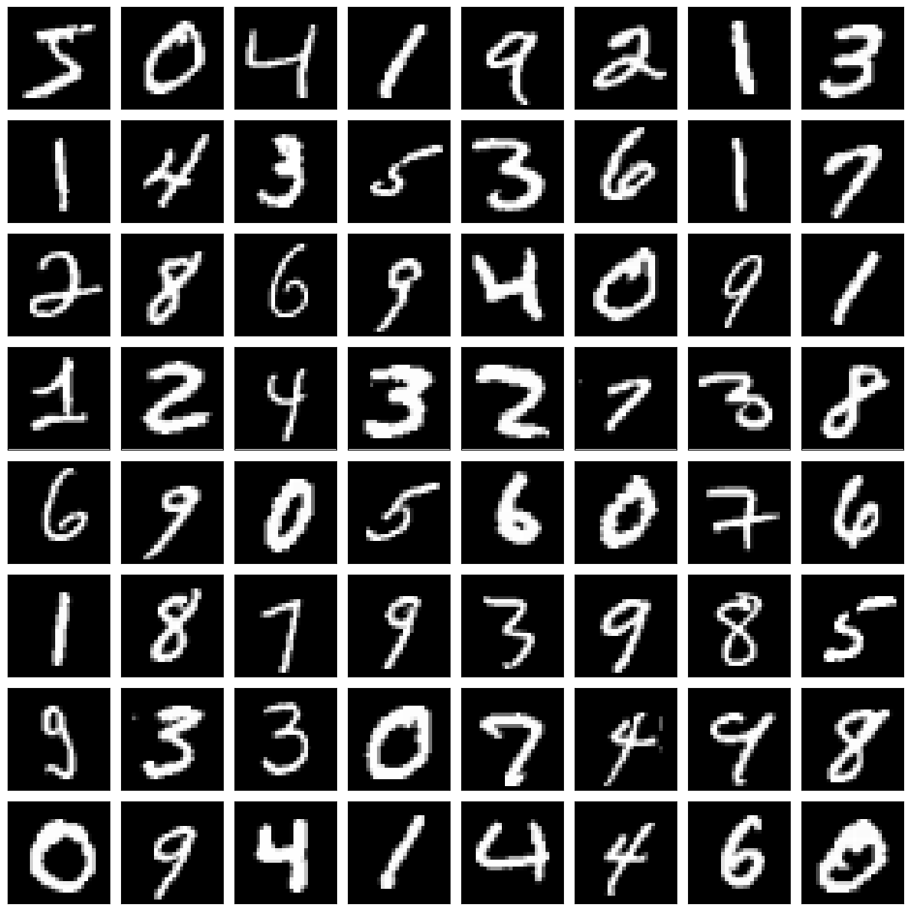
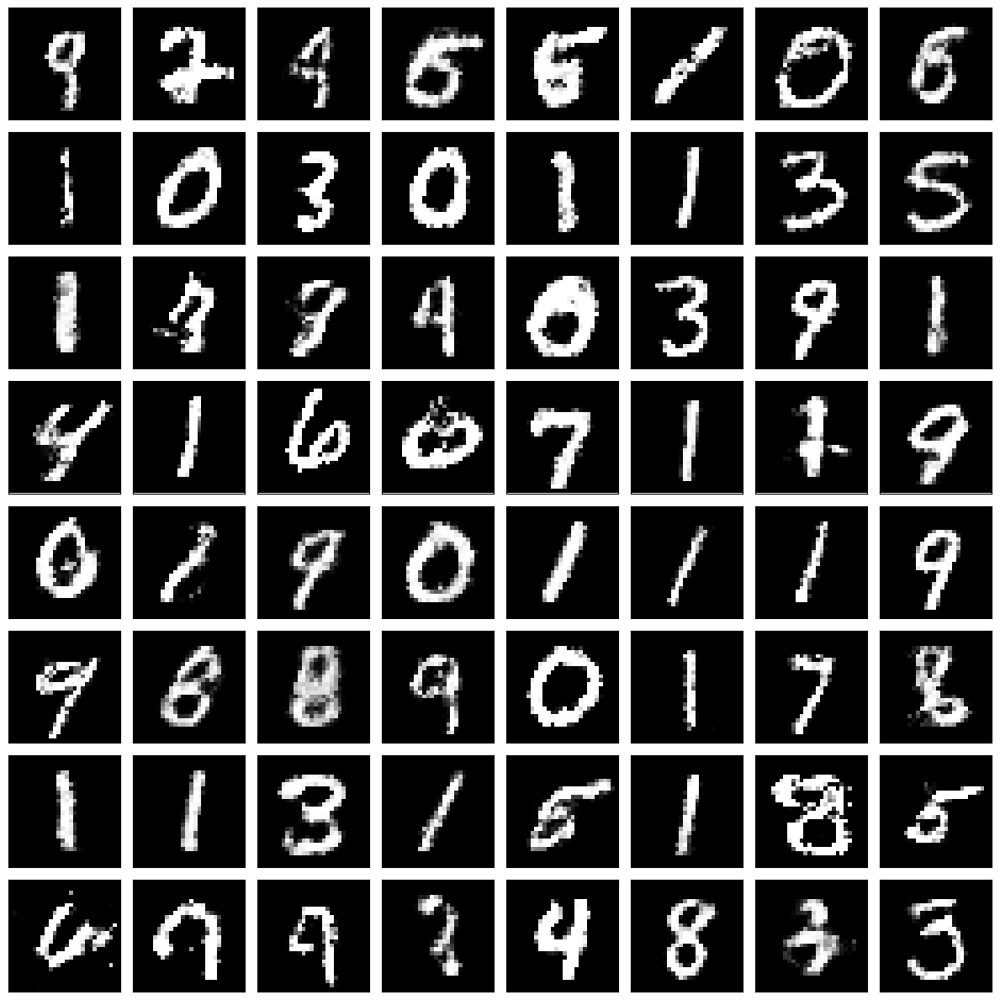

# Generative Adversarial Networks (Goodfellow et al., 2014)
This code implements the fully connected generator and discriminator for the MNIST dataset as described in Goodfellow et al. (2014), ["Generative Adversarial Networks"](https://arxiv.org/abs/1406.2661).
I extend the experiment by applying the architecture to the Fashion-MNIST dataset.


*Figure: The original GAN objective, where G denotes the generator and D the discriminator (Goodfellow et al., 2014).*

Original code and hyperparameters from the paper can be found [here](https://github.com/goodfeli/adversarial).

## MNIST (fully connected model)

#### Model Architecture:

Generator:
* Input layer: 100 units (Uniform[-1, 1] noise)
* Dense layer: 1200 units, ReLU
* Dense layer: 1200 units, ReLU
* Output layer: 784 units, Sigmoid
* Learnable parameters: 2503984

Discriminator:
* Input layer: 784 units (flattend 28x28 gray-scale image)
* Maxout layer: 240 units, 5 pieces
* Maxout layer: 240 units, 5 pieces
* Output layer: 1 unit, Linear
* Learnable parameters: 1231441

#### Hyperparameters/Settings:
* Epochs: 100  
* Batch size: 128
* Objective: Binary Cross-Entropy Loss with Logits
* Generator optimizer: Adam
* Discriminator optimizer: Adam
* Generator learning rate: 0.002  
* Discriminator learning rate: 0.002  
* Generator betas: (0.5, 0.999)  
* Discriminator betas: (0.5, 0.999)  

#### Training Data:


#### GAN Training Losses:


#### Fake Data:



## Fashion-MNIST (fully connected model)

#### Model Architecture:

Generator:
* Input layer: 100 units (Uniform[-1, 1] noise)
* Dense layer: 1200 units, ReLU
* Dense layer: 1200 units, ReLU
* Output layer: 784 units, Sigmoid
* Learnable parameters: 2503984

Discriminator:
* Input layer: 784 units (flattend 28x28 gray-scale image)
* Maxout layer: 240 units, 5 pieces
* Maxout layer: 240 units, 5 pieces
* Output layer: 1 unit, Linear
* Learnable parameters: 1231441

#### Hyperparameters/Settings:
* Epochs: 100  
* Batch size: 128
* Objective: Binary Cross-Entropy Loss with Logits
* Generator optimizer: Adam
* Discriminator optimizer: Adam
* Generator learning rate: 0.0002
* Discriminator learning rate: 0.0002
* Generator betas: (0.5, 0.999)
* Discriminator betas: (0.5, 0.999)

#### Training Data:


#### GAN Training Losses:


#### Fake Data:


## Citations

```bibtex
@misc{goodfellow2014generativeadversarialnetworks,
      title={Generative Adversarial Networks}, 
      author={Ian J. Goodfellow and Jean Pouget-Abadie and Mehdi Mirza and Bing Xu and David Warde-Farley and Sherjil Ozair and Aaron Courville and Yoshua Bengio},
      year={2014},
      eprint={1406.2661},
      archivePrefix={arXiv},
      primaryClass={stat.ML},
      url={https://arxiv.org/abs/1406.2661}, 
}
```

```bibtex
@misc{goodfellow2013maxoutnetworks,
      title={Maxout Networks}, 
      author={Ian J. Goodfellow and David Warde-Farley and Mehdi Mirza and Aaron Courville and Yoshua Bengio},
      year={2013},
      eprint={1302.4389},
      archivePrefix={arXiv},
      primaryClass={stat.ML},
      url={https://arxiv.org/abs/1302.4389}, 
}
```